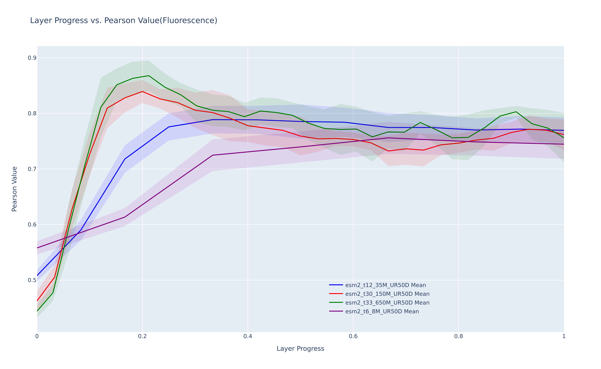
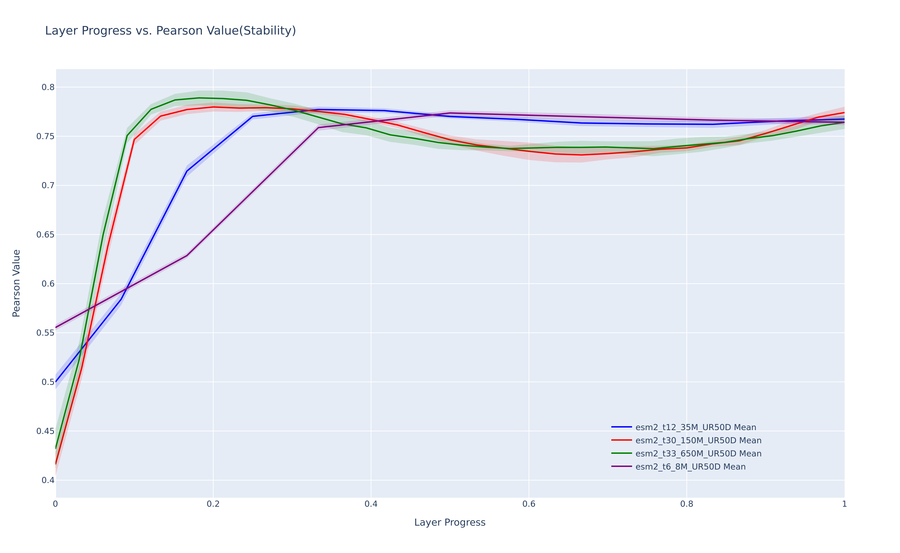

# ESM explainability project

This project focuses on ESM explainability

## Installation

```bash
pip install fair-esm wandb umap-learn plotly
```

Please install pytorch according to the official [instructions](https://pytorch.org/get-started/locally/)


## Training

To generate esm embeddings please refer to the [ESM repo](https://github.com/facebookresearch/esm)

To run the training use the `python full_train.py`

## Results



